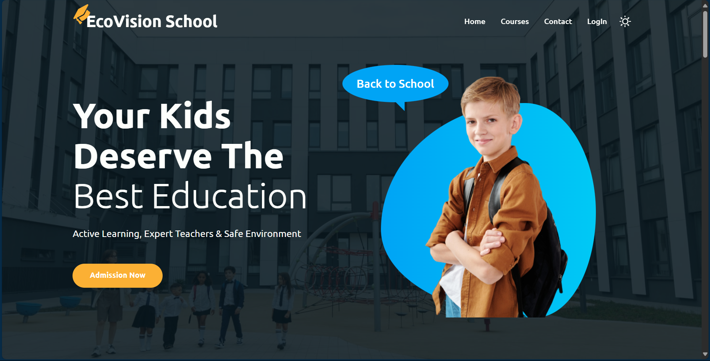

# EcoVision School Management System

  

A robust school management system built with Spring Boot, designed to streamline school operations through secure authentication, RESTful APIs, and an intuitive web interface. The application leverages Spring Core, Spring Boot, Spring Security, JPA/Hibernate, and Spring JDBC to provide a scalable and maintainable solution for managing school data, with features like user authentication, performance monitoring, and a user-friendly frontend.

## Screenshots

### Homepage
  
*The homepage with a welcoming message and admission call-to-action.*

### Login Page
  
*The login page for user authentication with a "New User?" link for registration.*

### Contact Page
  
*The contact page with a form to send messages and school contact details.*

## Table of Contents

- [Features](#features)
- [Technologies Used](#technologies-used)
- [Algorithms and Techniques](#algorithms-and-techniques)
- [Project Structure](#project-structure)
- [Prerequisites](#prerequisites)
- [Installation](#installation)
- [Running the Application](#running-the-application)
- [API Endpoints](#api-endpoints)
- [Contributing](#contributing)
- [License](#license)
- [Acknowledgments](#acknowledgments)

## Features

- **Secure Authentication**: Implements user login with Spring Security, supporting role-based access (e.g., admin, teacher, student). Includes a login page and registration option ("New User?").
- **RESTful APIs**: Provides endpoints for managing school operations, such as user management, course scheduling, and student records.
- **MVC Architecture**: Follows the Model-View-Controller pattern for clean separation of concerns, with controllers handling requests, models defining entities, and views rendering the frontend.
- **Database Management**: Uses JPA and Hibernate for ORM, enabling efficient entity management and database interactions. Spring JDBC is integrated for optimized queries.
- **Security Measures**: Configures Spring Security for authentication, authorization, and protection against common vulnerabilities (e.g., CSRF, XSS).
- **Aspect-Oriented Programming (AOP)**: Applies AOP to handle cross-cutting concerns like logging, transaction management, and performance monitoring.
- **Custom Validations**: Implements validation rules for user inputs (e.g., email format, password strength) to ensure data integrity.
- **Performance Monitoring**: Utilizes Spring Boot’s monitoring tools (e.g., Actuator) to track application health, metrics, and performance.
- **User-Friendly Interface**: Features a responsive web interface with pages for the homepage, login, contact, and courses, styled with a modern dark theme.
- **Contact Form**: Allows users to send messages to the school via a contact form with fields for name, mobile number, email, subject, and message.
- **Subscription Option**: Includes a subscription form for users to join the mailing list and receive updates.

## Technologies Used

- **Java**: Version 17
- **Spring Boot**: Version 3.3.1
- **Spring Core**: For dependency injection and core framework features
- **Spring Security**: For authentication and authorization
- **Spring Data JPA**: For ORM with Hibernate
- **Spring JDBC**: For efficient database interactions
- **MySQL**: As the relational database
- **Thymeleaf**: For server-side rendering of HTML templates
- **HTML5, CSS, JavaScript**: For the frontend interface
- **Maven**: For dependency management and build automation
- **Git**: For version control

## Algorithms and Techniques

- **Authentication and Authorization**:
  - **Technique**: Uses Spring Security’s authentication manager to validate user credentials against stored data. Passwords are hashed (e.g., using BCrypt) for secure storage.
  - **Role-Based Access Control**: Implements roles (e.g., `ROLE_ADMIN`, `ROLE_USER`) to restrict access to certain endpoints or pages.

- **Database Operations**:
  - **Entity Management**: Maps Java objects to database tables using JPA/Hibernate, with annotations like `@Entity`, `@Table`, and `@Column`.
  - **Query Optimization**: Leverages Spring JDBC for custom queries where JPA performance is insufficient, reducing database load.
  - **Transaction Management**: Uses Spring’s `@Transactional` annotation to ensure data consistency during operations like user registration or course updates.

- **Performance Monitoring**:
  - **Technique**: Integrates Spring Boot Actuator to expose endpoints (e.g., `/actuator/health`, `/actuator/metrics`) for monitoring application health and performance.
  - **AOP**: Applies aspects to log method execution times and monitor resource usage, aiding in performance optimization.

- **Input Validation**:
  - **Technique**: Uses Spring’s `@Valid` annotation with custom validators (e.g., email regex, required fields) to enforce data integrity before processing.
  - **Algorithm**: Rule-based validation with regular expressions for fields like email and phone number.

- **Frontend Rendering**:
  - **Technique**: Uses Thymeleaf to render dynamic HTML templates, binding server-side data to the UI (e.g., displaying contact details on the contact page).

- **Form Handling**:
  - **Technique**: Processes form submissions (e.g., contact form, subscription form) using Spring MVC, with validation and error handling to ensure reliable data submission.

## Project Structure

```
EcoVision-School/
├── src/
│   ├── main/
│   │   ├── java/
│   │   │   ├── com/
│   │   │   │   ├── ecovisionschool/
│   │   │   │   │   ├── config/
│   │   │   │   │   │   ├── SecurityConfig.java
│   │   │   │   │   ├── controller/
│   │   │   │   │   │   ├── HomeController.java
│   │   │   │   │   │   ├── AuthController.java
│   │   │   │   │   │   ├── ContactController.java
│   │   │   │   │   ├── model/
│   │   │   │   │   │   ├── User.java
│   │   │   │   │   │   ├── Course.java
│   │   │   │   │   │   ├── ContactMessage.java
│   │   │   │   │   ├── repository/
│   │   │   │   │   │   ├── UserRepository.java
│   │   │   │   │   │   ├── CourseRepository.java
│   │   │   │   │   │   ├── ContactMessageRepository.java
│   │   │   │   │   ├── service/
│   │   │   │   │   │   ├── UserService.java
│   │   │   │   │   │   ├── ContactService.java
│   │   │   │   │   ├── aspect/
│   │   │   │   │   │   ├── LoggingAspect.java
│   │   │   │   │   ├── EcoVisionSchoolApplication.java
│   │   ├── resources/
│   │   │   ├── templates/
│   │   │   │   ├── home.html
│   │   │   │   ├── login.html
│   │   │   │   ├── contact.html
│   │   │   │   ├── courses.html
│   │   │   ├── static/
│   │   │   │   ├── css/
│   │   │   │   │   ├── styles.css
│   │   │   │   ├── js/
│   │   │   │   │   ├── scripts.js
│   │   │   ├── images/
│   │   │   │   ├── homepage.png
│   │   │   │   ├── login_page.png
│   │   │   │   ├── contact_page.png
│   │   │   ├── application.properties
│   │   ├── test/
│   │   │   ├── java/
│   │   │   │   ├── com/
│   │   │   │   │   ├── ecovisionschool/
│   │   │   │   │   │   ├── controller/
│   │   │   │   │   │   │   ├── HomeControllerTest.java
├── pom.xml
├── README.md
├── LICENSE
├── .gitignore
```

- `config/`: Contains configuration classes (e.g., Spring Security setup).
- `controller/`: Handles HTTP requests and renders views.
- `model/`: Defines JPA entities (e.g., `User`, `Course`, `ContactMessage`).
- `repository/`: Provides data access layers using Spring Data JPA.
- `service/`: Implements business logic.
- `aspect/`: Contains AOP aspects for logging and monitoring.
- `templates/`: Stores Thymeleaf HTML templates for the frontend.
- `static/`: Holds static assets like CSS, JavaScript, and images.
- `application.properties`: Configures database, server, and other properties.

**Note**: This structure is an approximation based on typical Spring Boot projects. Please replace it with the actual file structure of the repository.

## Prerequisites

- **Java Development Kit (JDK)**: Version 17 or higher.
- **Maven**: For dependency management and build automation.
- **MySQL**: Version 8.0 or higher (assumed; adjust if different).
- **IDE**: IntelliJ IDEA, Eclipse, or VS Code with Java extensions (optional but recommended).
- **Git**: To clone the repository.

## Installation

1. **Clone the Repository**:
   ```bash
   git clone https://github.com/MostafaAbdulazziz/EcoVision-School.git
   cd EcoVision-School
   ```

2. **Set Up the Database**:
   - Install MySQL if not already installed.
   - Create a database named `ecovision_school`:
     ```sql
     CREATE DATABASE ecovision_school;
     ```
   - Update the `src/main/resources/application.properties` file with your database credentials:
     ```properties
     spring.datasource.url=jdbc:mysql://localhost:3306/ecovision_school
     spring.datasource.username=your_username
     spring.datasource.password=your_password
     spring.jpa.hibernate.ddl-auto=update
     spring.jpa.show-sql=true
     ```

3. **Install Dependencies**:
   - Run the following command to download dependencies:
     ```bash
     mvn clean install
     ```

4. **Verify Java Version**:
   ```bash
   java -version
   ```
   Ensure output shows Java 17 or higher.

## Running the Application

1. **Build the Project**:
   ```bash
   mvn clean package
   ```

2. **Run the Application**:
   ```bash
   mvn spring-boot:run
   ```
   Alternatively, if you built a JAR file:
   ```bash
   java -jar target/ecovision-school-0.0.1-SNAPSHOT.jar
   ```

3. **Access the Application**:
   - Open a browser and navigate to `http://localhost:8080`.
   - The homepage will display a welcoming message and an "Admission Now" button.
   - Navigate to `/login` to access the login page. Use default credentials (e.g., username: `admin`, password: `admin`) or register a new user via the "New User?" link.
   - Visit `/contact` to use the contact form, view school details, or subscribe to the mailing list.

## API Endpoints

The application exposes RESTful APIs for managing school operations. Below are some example endpoints (inferred; adjust based on actual implementation):

- **Authentication**:
  - `POST /api/auth/login` - Authenticate a user and return a token (if using JWT).
  - `POST /api/auth/register` - Register a new user.

- **User Management**:
  - `GET /api/users` - Retrieve all users (admin only).
  - `GET /api/users/{id}` - Retrieve a user by ID.
  - `PUT /api/users/{id}` - Update a user’s details.

- **Course Management**:
  - `GET /api/courses` - Retrieve all courses.
  - `POST /api/courses` - Create a new course (admin only).

- **Contact Messages**:
  - `POST /api/contact` - Submit a contact form message.

- **Monitoring**:
  - `GET /actuator/health` - Check application health.
  - `GET /actuator/metrics` - View performance metrics.

**Note**: These endpoints are inferred based on typical Spring Boot applications. Please update with the actual endpoints from your project.

## Contributing

We welcome contributions to enhance the EcoVision School Management System! To contribute:

1. Fork the repository.
2. Create a new branch (`git checkout -b feature/your-feature`).
3. Make your changes and commit (`git commit -m "Add your feature"`).
4. Push to your branch (`git push origin feature/your-feature`).
5. Open a pull request with a clear description of your changes.

Please follow the [Code of Conduct](CODE_OF_CONDUCT.md) and ensure tests (if any) pass.

## License

This project is licensed under the [MIT License](LICENSE). See the [LICENSE](LICENSE) file for details.

## Acknowledgments

- Developed by Mostafa Abdul Aziz.
- Built using Spring Boot and related technologies.
- Thanks to the open-source community for tools and libraries.

